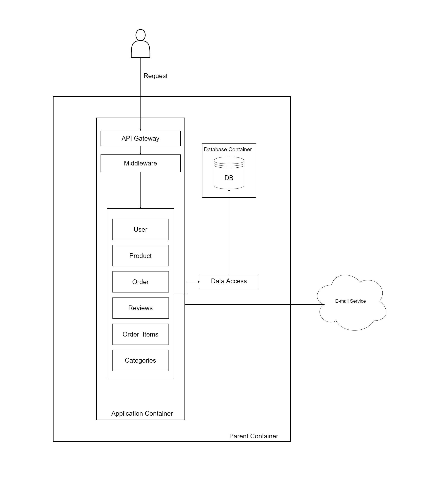

# Online Marketplace API

## Table of Contents

1. [Project Description and Overview](#project-description-and-overview)
2. [Features](#features)
3. [Technologies Used](#technologies-used)
4. [System Design](#system-design)
5. [Getting Started](#getting-started)
6. [API Documentation](#api-documentation)
7. [API Endpoints](#api-endpoints)
8. [Troubleshooting](#troubleshooting)

## Project Description and Overview

This project is a comprehensive RESTful API for an online marketplace platform. It enables users to buy and sell products, manage inventory, and process orders efficiently.

Key aspects of the marketplace include:

- **User roles:**
  - **Admin/Seller:** Manages the entire application, including user accounts, products, orders, and categories. They are also responsible for selling products.
  - **Buyer:** Can browse products, place orders, and leave reviews.
- **Product management:** Allows for creation, updating, and deletion of products, with the ability to categorize them for easy browsing.
- **Order processing:** Supports order placement, tracking, and status updates.
- **Review system:** Enables buyers to rate and review products they've purchased and have completed status.
- **Authentication and Authorization:** Implements secure user registration, login, and role-based access control.

## Features

- **User Management**
  - Registration with email verification for buyers
  - Secure login and profile management

- **Role-Based Access Control**
  - Admin/Seller: Full control over marketplace
  - Buyer: Shopping and order management access

- **Product Management**
  - Admin/seller can manage products
  - Categorize and feature products

- **Order Processing**
  - Place and track orders
  - View order history

- **Search and Browse**
  - Browse by category
  - Advanced search (category, min price, max price, name)

- **Review and Rating System**
  - Rate and review purchased products with order completed
  - Display reviews and comments as well review owners

- **Notifications**
  - Email notifications for orders
  - Email verification for new accounts (buyers)

- **Admin Controls**
  - Manage users, products, orders, and categories

- **Security Features**
  - JWT-based authentication
  - Role-based authorization
  - Data encryption at rest

- **API Documentation**
  - Swagger Open API

- **Docker Support**
  - Containerized deployment
  - Docker Compose for service management

## Technologies Used

- **Backend Frameworks:** Node.js, Express.js
- **Database:** PostgreSQL
- **ORM:** Sequelize
- **Authentication:** JWT (JSON Web Tokens)
- **API Documentation:** Swagger / OpenAPI 3.0
- **Containerization:** Docker
- **Build Tool:** npm (Node Package Manager)

## System Design

### Overview
The system uses an approach of containerizing to manage different aspects of the application. The architecture is divided into three main parts of containers:

- **Parent Container**: This container houses the other two containers. It manages and organizes everything, ensuring all other containers work smoothly together.
- **Application Container**: This container contains the business logic, including all the code and tools needed to process requests, perform business logic, and handle user requests.
- **Database Container**: Houses the database system, managing data storage where, in our case, it’s PostgreSQL.

### Architecture Diagram


### Request Process Flow
1. **User Request**: The process begins with a user sending a request.
2. **API Gateway**: The request goes through the API Gateway, which determines the appropriate controller to handle the request (e.g., product controller, review controller).
3. **Middleware**: The request then passes through middleware, where factors like authentication and authorization are checked. This ensures that some resources are accessible to certain users and others are not.
4. **Controller**: After passing through middleware, the request is sent to the relevant controller, which processes the business logic, such as updating product details.
5. **External Services**: If the controller needs to interact with an external service (e.g., sending an email), it communicates with that external service as part of its processing.
6. **Data Access Layer (DAL)**: If the controller needs to interact with the database, it communicates with the DAL using Sequelize. The DAL acts as a bridge between the business logic and the database.
7. **Database Interaction**: The DAL performs the necessary operations on the database.
8. **Response Formation**: Once database operations are complete, the DAL returns data to the controller, which forms a response and sends it back to the user.

## Getting Started

There are two ways to run this application: the standard method and using Docker.

### Environment Setup

1. Rename the .env.example file to .env.
2. Edit the .env file:
   - For standard method: Set HOST=localhost.
   - For Docker method: Set HOST=db.

### Option 1: Standard Method

**Prerequisites:**

- Node.js
- npm
- PostgreSQL 16

1. Clone the repository:

    ```sh
    git clone https://github.com/kent250/awesomity-challenge.git
    cd awesomity-challenge
    ```

2. Install dependencies:

    ```sh
    npm install
    ```

3. Set up PostgreSQL:
   - Ensure PostgreSQL 16 is installed and running.
   - Create a new server and database for the project.
   - Edit the .env file to match your PostgreSQL credentials:

    ```env
    HOST=localhost
    DB_USER=your_postgres_username
    DB_PORT=5432
    PASSWORD=your_postgres_password
    DATABASE_NAME=your_database_name
    ```

4. Start the application:

    ```sh
    nodemon app.js
    # or
    node app.js
    ```

5. The API will be accessible at [http://localhost:3000](http://localhost:3000).

Note: The application uses Sequelize ORM, which will automatically create the necessary database tables on startup.

### Option 2: Using Docker

This is a multi-container application using PostgreSQL 16.3 and Node.js 21-alpine.

1. Navigate to the parent directory containing the .env and docker-compose.yml files.
2. Set up the .env file as described in the Environment Setup section.
3. Run the following command:

    ```sh
    docker-compose up
    ```

This command will:
- Download the PostgreSQL 16.3 image
- Pull the custom Node.js image from Docker Hub
- Set up and run the containers

4. The application will be available at [http://localhost:3000](http://localhost:3000).

## Troubleshooting

If only the database container starts, you can try the following:

a. Restart all services:

    ```sh
    docker-compose restart
    ```

b. If the above doesn't work, stop all containers and start again:

    ```sh
    docker-compose down
    docker-compose up
    ```

c. To see logs and identify any issues:

    ```sh
    docker-compose logs
    ```

d. If problems persist, you can try rebuilding the containers:

    ```sh
    docker-compose up --build
    ```

These commands should help ensure both the database and application containers start properly.

## API Documentation

Once the application is running (using either method), you can access the Swagger documentation at:

[http://localhost:3000/api-docs](http://localhost:3000/api-docs)

## API Endpoints

### Authentication

- `POST /api/auth/register/admin`: Register a new admin account
- `POST /api/auth/register/buyer`: Register a new buyer account
- `POST /api/auth/login`: User login
- `GET /api/auth/verify/buyer/{token}`: Verify buyer account

### Category Management

- `POST /api/category`: Create a new category
- `GET /api/category`: Retrieve all categories

### Order Management

- `POST /api/orders/`: Create a new order
- `GET /api/orders/{id}`: Retrieve details of a specific order
- `PATCH /api/orders/{id}`: Update the status of an order
- `GET /api/orders/history`: View order history

### Product Management

- `POST /api/product`: Create a new product
- `GET /api/product`: Retrieve all products
- `PATCH /api/product/{id}`: Update a product by ID
- `GET /api/product/{id}`: Get details of a single product
- `GET /api/product/category/{categoryId}`: Retrieve products by category
- `PUT /api/product/featured/{id}`: Mark a product as featured
- `PUT /api/product/unfeatured/{id}`: Remove featured status from a product
- `GET /api/product/search`: Search for products based on various criteria

### Product Reviews

- `POST /api/reviews`: Create a new review
- `GET /api/reviews/product/{productId}`: Retrieve reviews for a specific product

### User Profile Management

- `GET /api/user/profile`: Get user profile details
- `PATCH /api/user/profile`: Update user profile

### User Management (Admin)

- `GET /api/user/allusers`: Retrieve all users

For full details on request bodies, response formats, and authentication requirements, please refer to the Swagger documentation.

## Database Schema

### Entities

1. **User**
   - **Fields:** id, name, email (encrypted), password, role, is_email_verified
   - **Roles:** buyer, admin

2. **Category**
   - **Fields:** id, name, description

3. **Product**
   - **Fields:** id, product_name, category_id, description, price, stock_quantity, is_featured

4. **Order**
   - **Fields:** id, buyer_id, status, total_amount
   - **Status options:** pending, paid, shipped, delivered, cancelled, completed

5. **OrderItems**
   - **Fields:** id, order_id, product_id, quantity, unit_price

6. **Review**
   - **Fields:** id, product_id, order_id, buyer_id, rating, comment

### Relationships

1. **Product - Category**
   - A Product belongs to one Category
   - A Category can have many Products

2. **User - Order**
   - A User (as buyer) can have many Orders
   - An Order belongs to one User (buyer)

3. **Order - OrderItems**
   - An Order can have many OrderItems
   - An OrderItem belongs to one Order

4. **OrderItems - Product**
   - An OrderItem is associated with one Product
   - A Product can be in many OrderItems

5. **Review - User**
   - A Review belongs to one User (buyer)
   - A User can have many Reviews

6. **Review - Product**
   - A Review belongs to one Product
   - A Product can have many Reviews

7. **Review - Order**
   - A Review is associated with one Order
   - An Order can have many Reviews

### Key Features

- **Email encryption** for User data
- **Cascading delete** for Orders and associated OrderItems
- **Rating validation** for Reviews (0-5 range)
- **Featured flag** for Products
- **Email verification** status for Users
